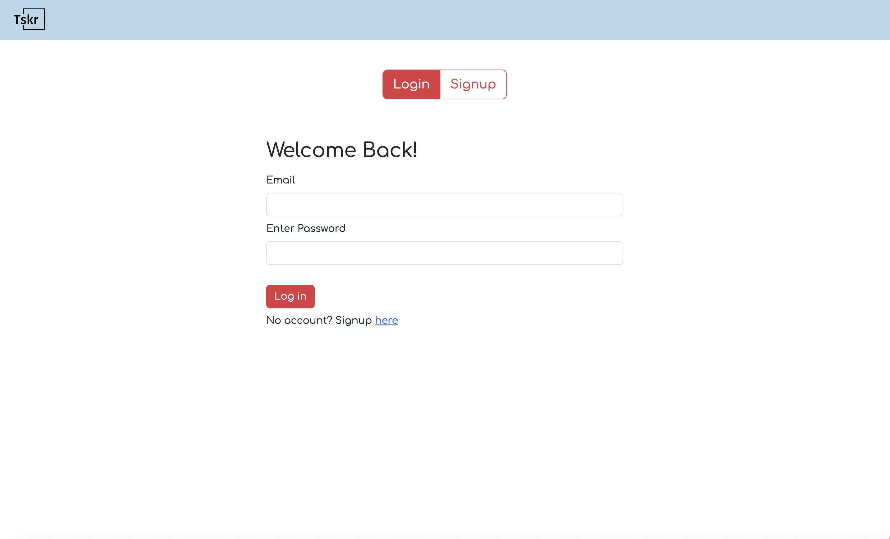
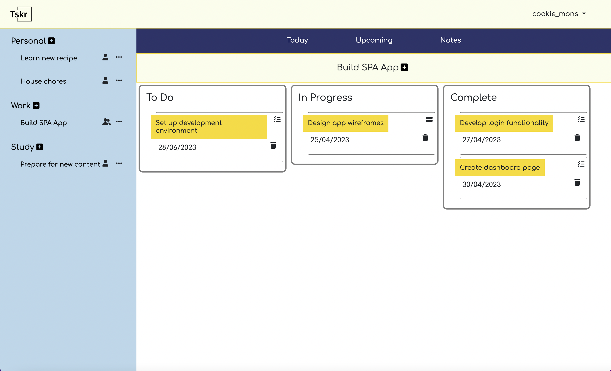
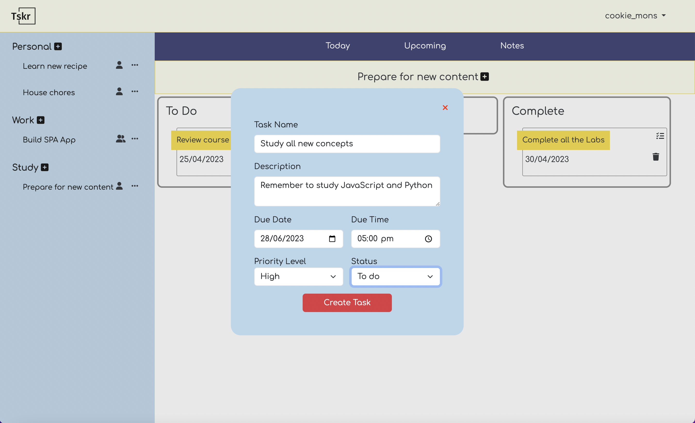
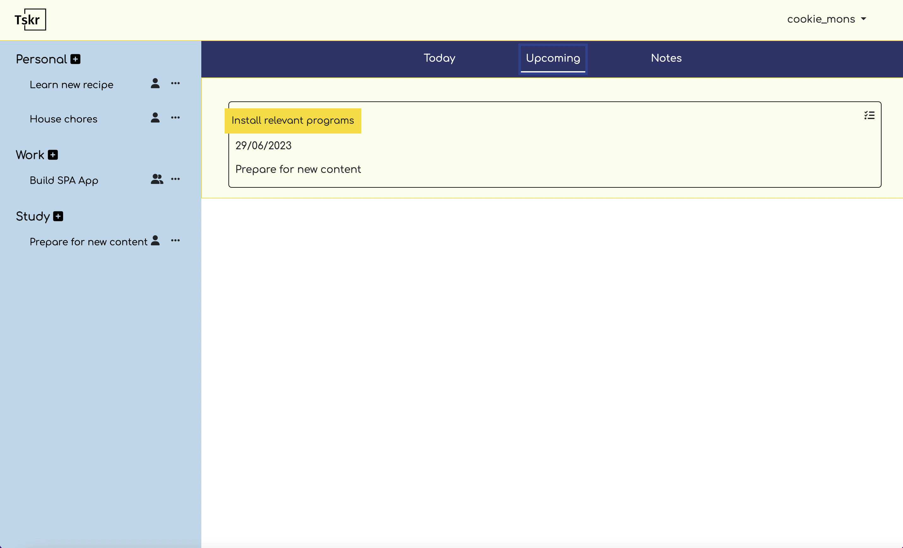
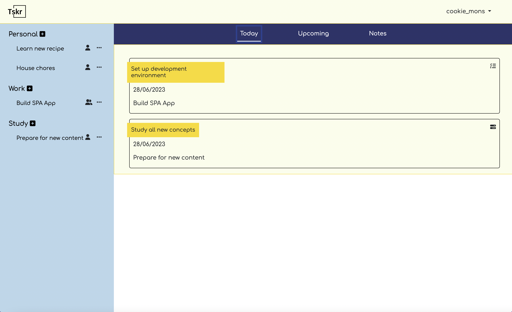
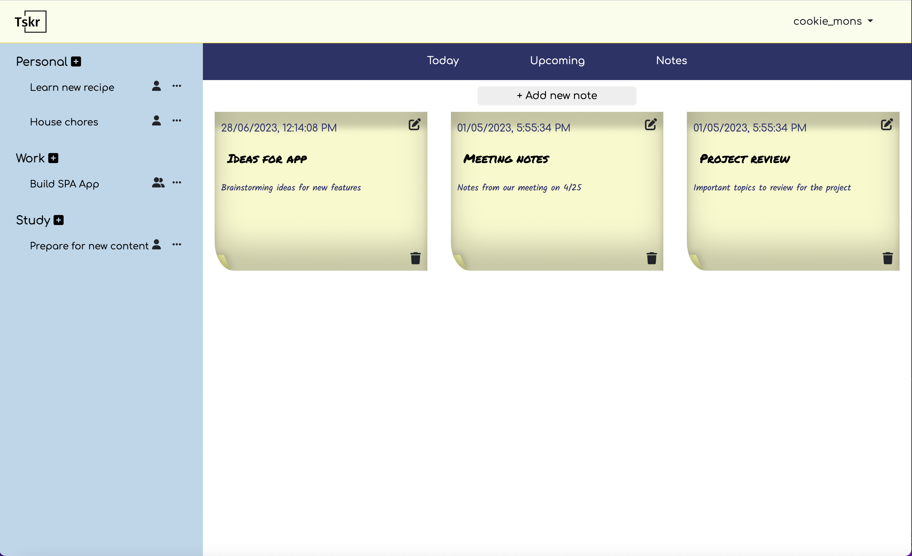

# Tasker 

Tasker (TSKR) is a task management web app built with Node.js, Express, JavaScript, HTML, Bootstrap, and CSS. The app allows users to create an account, add friends, and create individual or group projects for work, study, or personal use. Users can assign friends to their projects and create tasks within each project. Tasks can be moved from to-do to in-progress and completed sections using drag and drop in a kanban style.

## Table of Contents
<!-- toc -->
- [Authors](#authors)
- [Screenshots](#screenshots)
- [Features](#features)
- [Database Schema](#database-schema)
- [How to Run the App](#how-to-run-the-app)

<!-- tocstop -->

### Authors 
- https://github.com/justinKenealy
- https://github.com/Tania-Hss
- https://github.com/Munsat 
- https://github.com/poradaT

### Screenshots
<div>
  
  
  
  
  
  
</div>

### Features

- User authentication: Users can log in, create an account, and add friends who are also users of the app. The app uses reCAPTCHA for added security during the account authentication process.

- Project creation: Users can create projects for work, study, or personal purposes and can choose whether the project is an individual or group project.

- Task management: Users can create tasks within a project assign due date, priority level and status to move them from to-do, in-progress, and completed in a kanban-style using drag and drop.

- Comments: Users can add comments under a task to communicate and provide feedback to other collaborators.

- Notes: Users can create personal notes in notes section to keep track of their ideas.

- Middleware: The app uses middleware for HTTP logging and error handling.

- Testing: Password management functionality has been tested using the Jest testing framework.

### Database Schema
The app uses PostgreSQL for the database and has the following schema:

```
CREATE TABLE users (
  id SERIAL PRIMARY KEY,
  user_name VARCHAR(255) NOT NULL,
  first_name VARCHAR(255) NOT NULL,
  last_name VARCHAR(255) NOT NULL,
  email VARCHAR(255) UNIQUE NOT NULL,
  password_hash VARCHAR(255) NOT NULL,
  friends_array TEXT ARRAY 
);

CREATE TABLE projects (
  id SERIAL PRIMARY KEY,
  user_id INT,
        CONSTRAINT fk_projects_users
        FOREIGN KEY(user_id)
        REFERENCES users(id)
        ON DELETE CASCADE,
  collab INT[],
  category TEXT, 
  name VARCHAR(255) NOT NULL,
  task_type TEXT

);

CREATE TABLE tasks (
  id SERIAL PRIMARY KEY,
  project_id INT,
        CONSTRAINT fk_tasks_projects
        FOREIGN KEY(project_id)
        REFERENCES projects(id)
        ON DELETE CASCADE,
  name VARCHAR(255) NOT NULL,
  description TEXT,
  creation_date DATE,
  due_date DATE, 
  due_time TIME,
  priority_level INT, 
  status INT
);

CREATE TABLE comments (
    id SERIAL PRIMARY KEY,
    user_id INT,
          CONSTRAINT fk_comments_users
          FOREIGN KEY(user_id)
          REFERENCES users(id)
          ON DELETE CASCADE,
    user_name TEXT,
    task_id INT,
          CONSTRAINT fk_comments_tasks
          FOREIGN KEY(task_id)
          REFERENCES tasks(id)
          ON DELETE CASCADE,
    description TEXT,
    creation_date DATE
);

CREATE TABLE notes (
  id SERIAL PRIMARY KEY,
    user_id INT,
        CONSTRAINT fk_notes_users
        FOREIGN KEY(user_id)
        REFERENCES users(id)
        ON DELETE CASCADE,
  title TEXT,
  description TEXT,
  time TIMESTAMPTZ DEFAULT Now()
);
```

### How to Run the App
1. Clone this repository.
2. Run npm install to install dependencies.
3. Set up PostgreSQL database and run the schema.
4. Run npm start to start the server.
5. Open your browser and go to http://localhost:3000 to access the app.

### Testing

This project includes a suite of tests to ensure its functionality. The tests are written using the jest framework and can be executed as follows:

1. Ensure all project dependencies are installed: `npm install` in the root directory
2. Run the testing command `npm test`

Each test file contains multiple test cases, which are written using the 'descriobe', 'expect', and 'it' syntaxes. Within each test case, assertions are made using various testing methods to verify the expected behavior of the code.
